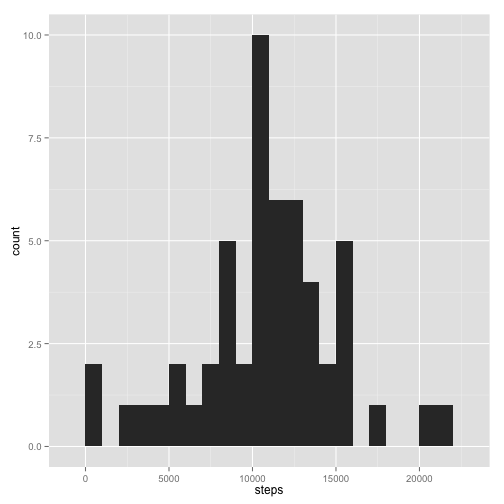
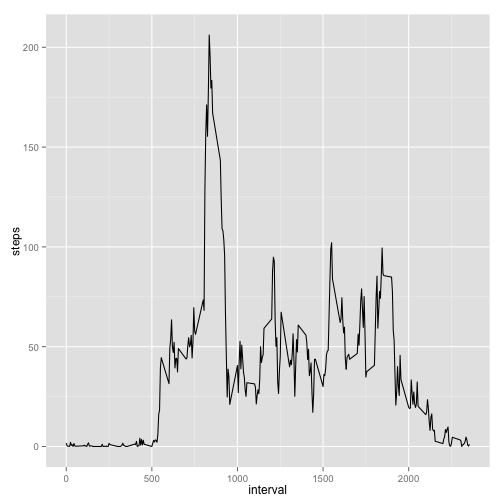
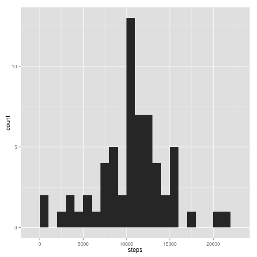
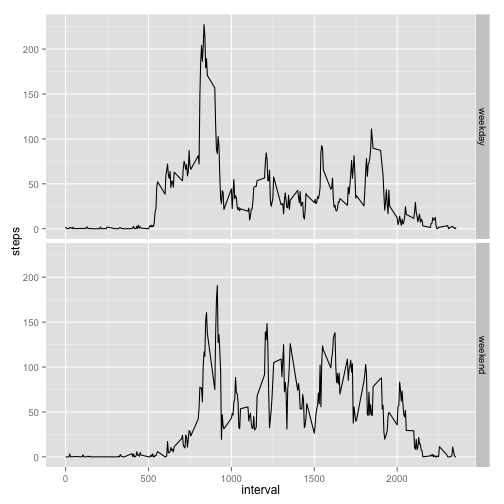

```r
setwd("~/Projects/Coursera/DataScienceSpec/RepResearch/RepData_PeerAssessment1")
#load required packeges
library(data.table)
```

```
## data.table 1.9.6  For help type ?data.table or https://github.com/Rdatatable/data.table/wiki
## The fastest way to learn (by data.table authors): https://www.datacamp.com/courses/data-analysis-the-data-table-way
```

```r
library(ggplot2)
#get the time of the analysis/document creation
time <- Sys.time()
```

---
title: "Reproducible Research: Peer Assessment 1"
author: "Igor Telezhinsky"
date:   2015-12-17 14:51:48
output: 
  html_document:
    keep_md: true
---

## Loading and preprocessing the data

The data can be loaded by unpacking zip archive and reading CSV file to *data.table* with the following code: 

```r
if(!file.exists("activity.csv")) unzip("activity.zip")
activity<-fread("activity.csv",sep = ",", stringsAsFactors=F)
```

It is worth coercing the **date** variable to *Date* type to utilize weekdays() function in subsequent analysis:

```r
activity$date<-as.Date(activity$date)
```

## What is mean total number of steps taken per day?

Let's calculate the total number of steps taken per each day by summing up all steps within each date:

```r
per_day<-activity[, sum(steps), by=date]; colnames(per_day)[2]<-"steps"
```

We can look at the histogram of the daily steps distribution with:

```r
qplot(steps, data=per_day, binwidth=1000)
```

 

and now compute the mean and the median of this distribution by:

```r
mean(per_day$steps, na.rm=T)
```

```
## [1] 10766.19
```

```r
median(per_day$steps, na.rm=T)
```

```
## [1] 10765
```

## What is the average daily activity pattern?

To answer the question we need to calculate the number of steps per each interval averaged across all days:

```r
per_int<-activity[, mean(steps, na.rm=T), by=interval]; colnames(per_int)[2]<-"steps"
```

The time series plot of the average daily activity is obtained with the following code:

```r
qplot(interval, steps, data=per_int, geom="line")
```

 

The interval having maximum steps is:

```r
per_int$interval[which.max(per_int$steps)]
```

```
## [1] 835
```
which corresponds to 8:35 in the morning.

## Imputing missing values

Our dataset contains missing values that can introduce some bias in the analysis results. The total number of missing values in the dataset is:

```r
sum(is.na(activity$steps))
```

```
## [1] 2304
```

More careful examining shows that the data are missing not for ocassional intervals scattered over the whole dataset, but rather they are missing for the complete days, i.e., all (288) intervals within a certain day. This can be looked at with the following code line (results are hidden for the sake of compactness):

```r
activity[,sum(is.na(steps)), by=date]
```

One of the approaches to fill in missing values could be filling each interval on a missing day by interval data calculated as average across the previous and the followng day. If there are two days one after another with missing data then they both will be given the same data calculated as the average of two days neighboring the missing days from both sides. If the missing day is the first or the last in the dataset, it can be filled in with the mean data across all days. This approach is implemented below:

```r
#copy the exising dataset
activity2<-copy(activity)

#find missing days
missing_dates<-activity2[, which(sum(is.na(steps)) == 288), by=date]; colnames(missing_dates)[2]<-"missing"

NR<-nrow(missing_dates)
for (i in 1:NR)
{
    #check if date is the first or the last in the datset
    if (missing_dates[i]$date == activity2[1]$date | missing_dates[i]$date == activity2[.N]$date)
    {
        #substitute NAs with the total mean coerced to integer (as steps are integers)
        activity2[{date %in% c(missing_dates[i])}]$steps <- as.integer(per_int$steps)
    }
    else
    {
        #find the day before the missing day; if the day found is also missing, continue the search
        d1<-missing_dates[i]$date-1; while(d1 %in% missing_dates$date) d1<-d1-1
        
        #find the day after the missing day; if the day found is also missing, continue the search
        d2<-missing_dates[i]$date+1; while(d2 %in% missing_dates$date) d2<-d2+1
        
        #find the mean of d1 and d2 data
        m<-activity2[{date %in% c(d1,d2)}, mean(steps), by=interval]; colnames(m)[2]<-"steps"
        
        #substitute NAs with the found mean coerced to integer (as steps are integers)
        activity2[{date %in% c(missing_dates[i])}]$steps <- as.integer(m$steps)
    }
}
```

Let's now answer our first question and see what has changed after missing values were imputed. To do this we repeat the excersize with our new dataset created above:

```r
per_day2<-activity2[, sum(steps), by=date]; colnames(per_day2)[2]<-"steps"
```

We can look at the histogram of the daily steps distribution with:

```r
qplot(steps, data=per_day2, binwidth=1000)
```

 

and now compute the mean and the median of this distribution by:

```r
mean(per_day2$steps)
```

```
## [1] 10600.93
```

```r
median(per_day2$steps)
```

```
## [1] 10641
```

Well, the results have slightly changed.

## Are there differences in activity patterns between weekdays and weekends?

Finally, let's look at differences in activity patterns between weekdays and weekends:

```r
#adding daytype variable to the dataset
activity2[,daytype:=ifelse(weekdays(date) %in% c("Saturday","Sunday"),"weekend","weekday")]
#converting daytype variable to factor
activity2<-transform(activity2,daytype=factor(daytype))
#calculate the number of steps per each interval averaged separately across all working week days and weekends
per_int2<-activity2[,mean(steps), by=list(interval,daytype)];colnames(per_int2)[3]<-"steps"
```

The time series plot of the corresponding activity is obtained with the following code line:

```r
qplot(interval, steps, data=per_int2, geom="line",facets = daytype ~ .)
```

 

Obviously, the patterns are different. Activity starts later at weekends and is on average higher during the day compared to working days. On working days the activity peaks at around rush hours and is rather low during the day.  


